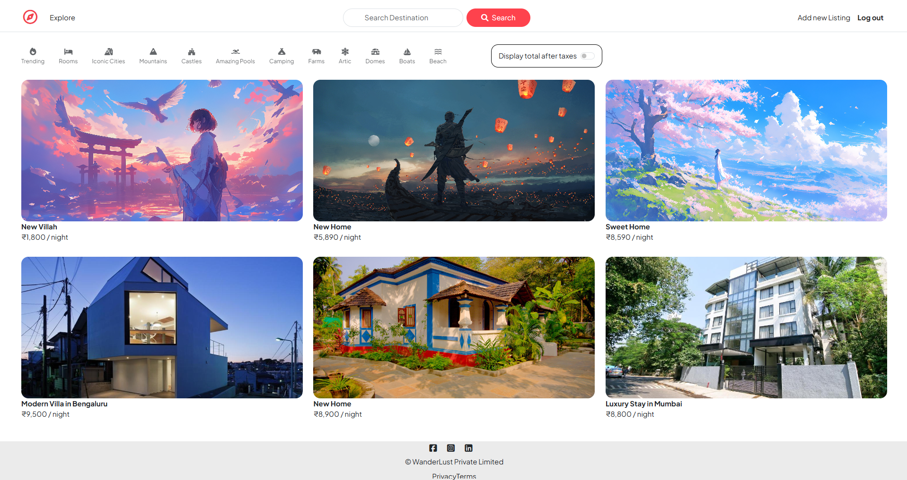
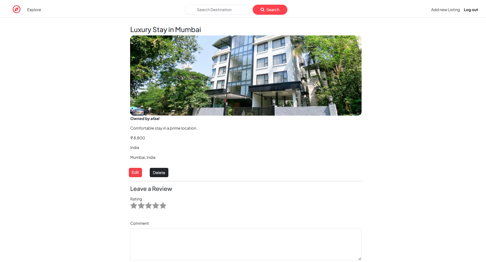
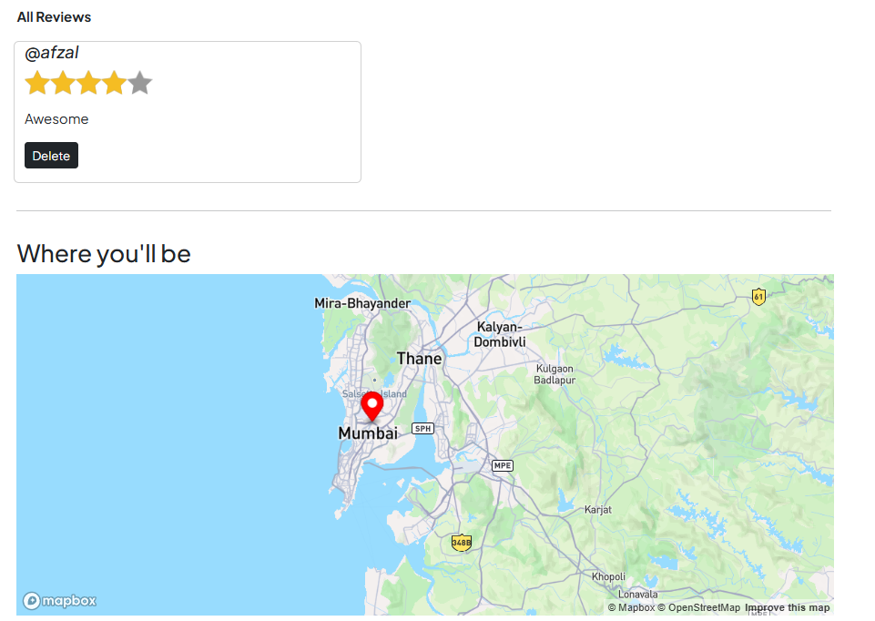
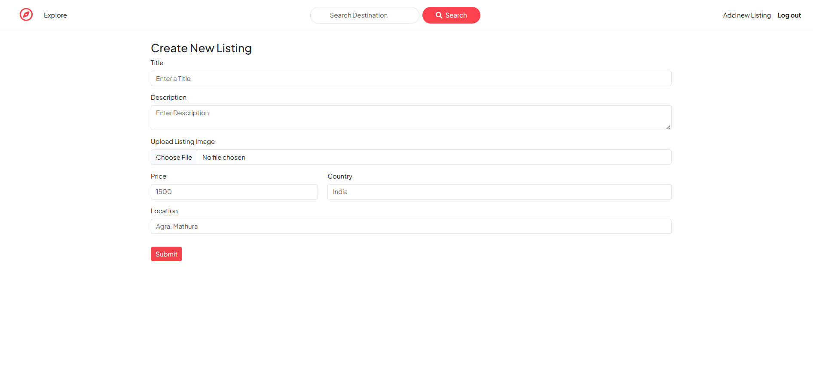

# WanderLust

A full-stack Airbnb-inspired web app for property listing, booking, and accommodation management.

**Live site:** [wanderlust-project-crni.onrender.com](https://wanderlust-project-crni.onrender.com/listings)

<br/>

## Screenshots

**Home — Browse Listings**


**Listing Detail**


**Reviews & Location Map**


**Create New Listing**


<br/>

## Features

- **Browse listings** — Filterable grid by category (Trending, Rooms, Mountains, Beach, etc.) with pricing and location
- **Search destinations** across all listings
- **Listing details** — Full view with images, owner, price, location, and edit/delete for owners
- **Reviews & ratings** — Leave a star rating and comment on any listing
- **Interactive map** — Mapbox-powered location view for each listing
- **Create/Edit/Delete listings** — Full CRUD with image upload
- **Authentication** — Login/logout with ownership-based permissions

<br/>

## Built With

- Node.js
- Express
- MongoDB Atlas
- EJS
- Mapbox

<br/>

## Running Locally

```bash
git clone https://github.com/mdafzalmalik/wanderlust.git
cd wanderlust
npm install
```

Set up your `.env` with MongoDB Atlas URI and Mapbox token, then:

```bash
node app.js
```

<br/>

## Contact

[LinkedIn](https://www.linkedin.com/in/mdafzalmalik/) · [Email](mailto:mdafzalmalik13@gmail.com) · [LeetCode](https://leetcode.com/u/mdafzalmalik/)
